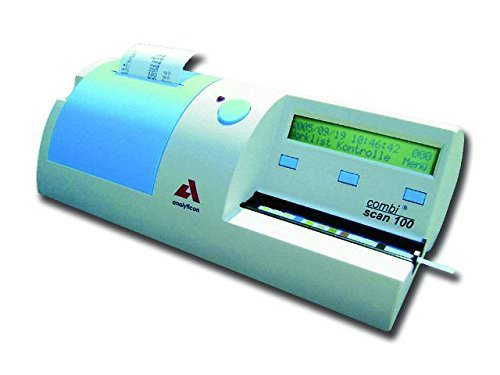
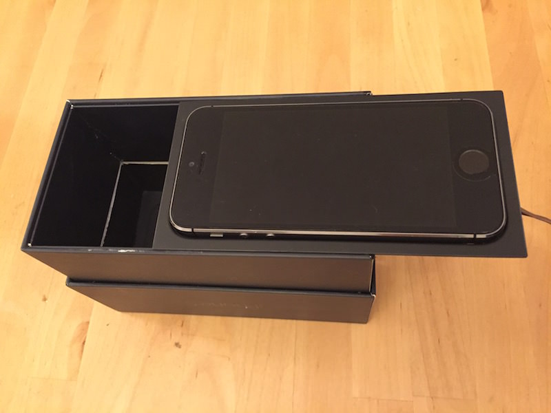
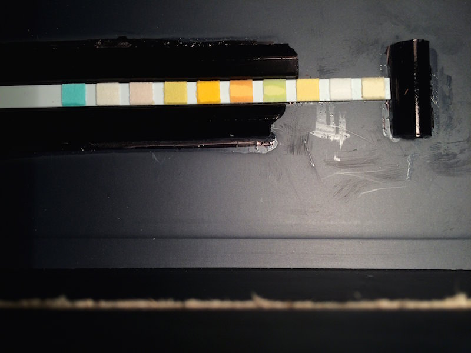
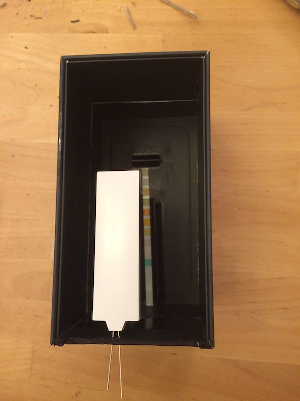
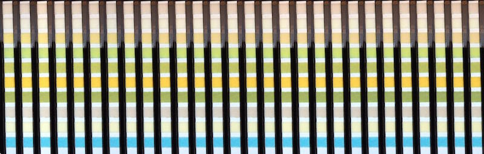

# RRPeeAnalyzer

Ah, [healthcare](http://en.wikipedia.org/wiki/Health_care)... it was always an area of interest to me... 
I was wondering what kind of test can you do at home to continuously monitor your health and came across [Urine Test Strips](http://en.wikipedia.org/wiki/Urine_test_strip). It sounds like a straight forward test until you discover that after dipping it into your [urine](http://en.wikipedia.org/wiki/Urine) you need to sit around with a [stopwatch](http://en.wikipedia.org/wiki/Stopwatch) and check results at certain time periods.

I checked out [Amazon](http://amazon.co.uk/) for a device that would do that for me but the cheapest [Urine Analyzer](http://www.amazon.co.uk/Combi-Scan-100-Urine-Analyzer/dp/B00F377MNI/) cost a whooping £854!

So, [Urine Test Strips](http://www.amazon.co.uk/Health-Parameter-Professional-Urinalysis-Multisticks/dp/B0032IKZV6/) and [Urine Analyzer](http://www.amazon.co.uk/Combi-Scan-100-Urine-Analyzer/dp/B00F377MNI/) is £863! - way too much for my curiosity.

### The Software
But hey, I'm an iOS dev and surely I can write an "App For That"! I quickly prototyped iOS app using [OpenCV](http://opencv.org) where you snap photo of test strip, app finds squares and... well... it could tell your results...

... the only problem is - you still need to stand with a freaking stopwatch and snap at the designated times! Even if I could add a timer to the app to snap at these intervals, no way I'm standing and staring at the stip for 2 minutes waiting for the results.

### The Hardware
So I decided to rig something up from stuff laying around.

At first I tried if an iPhone box height is enough for the camera to focus on things at the bottom - it wasn't - iPhone cammera needs around 10cm to focus. The solution was straight forward - to cut out the bottom of the smaller box and glue them together to double the height.

And if I am already making an iPhone holder, why not to fix test strip every time in more or less same place - that will simplify the app itself. I cut out a hole on the side where I will be inserting the test strip, then I cut a pen in half, and glued the two pieces to the bottom to create a base where the strip will be placed.

The position of the strip holder was my mistake. I didn't account that the iPhone's camera is not positioned in the middle - if I was to make another prototype I would move the strip holder to the right.
 
As for fixing the iPhone on top, I can use a piece of plastic that came in the iPhone box itself - I just need to cut out a small hole for the camera lense.

First test using iPhone flash.

Not bad but lighting is very uneven. Even if I would be able to compensate for that in software maybe I can do better.

I had backlit LED laying around so I decided to add it to check if lighting conditions will improve so I wouldn't need to use iPhone flash.

Because some light was leaking from the gap above iPhone I decided to cover it up to get a more consistant lighting conditions. 
And here you go... DIY Urine Analyzer!

Some testing action! (gross parts redacted).

First test result over time (multiple shots combined in one)

Not bad, but it seems like it still lacks light. Black coloured walls absorb light so I need to make them either white or reflective. And what can be simpler than using some backing foil!

Second test result over time (multiple shots combined in one)

### The Software
So how do we go from photo of test strip to values of Leukocytes, Nitrite, Urobilinogen, Protein, pH, Blood, Specific gravity, Ketones, Bilirubin and Glucose?

You can find iOS application in <a href="RRPeeAnalyzer">/RRPeeAnalyzer</a>. Hopefully I will find some time to write about it and how I use [OpenCV](http://opencv.org) to find rects at some point...

to be continued...

### Samples
If for any reason you are interested in samples, you can find them at <a href="Images/Samples/">/Images/Samples/</a>. Every directory is new test, and file are named with time offset.
