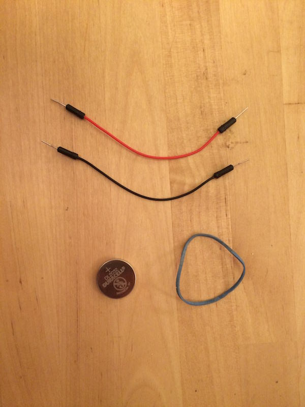

# RRPeeAnalyzer

Ah, [healthcare](http://en.wikipedia.org/wiki/Health_care)... it was always area of interest to me... 
I was wondering what kindof test you can do at home to continuously monitor your health and came around [Urine Test Strips](http://en.wikipedia.org/wiki/Urine_test_strip). That sounds like straight forward test untill you discover that after you dip it into your [urine](http://en.wikipedia.org/wiki/Urine) you need to sit around with [stopwatch](http://en.wikipedia.org/wiki/Stopwatch) and check results at certain time periods.

I checked [Amazon](http://amazon.co.uk/) for device that would do that for me but cheapest [Urine Analyzer](http://www.amazon.co.uk/Combi-Scan-100-Urine-Analyzer/dp/B00F377MNI/) cost whooping £854!

So, [Urine Test Strips](http://www.amazon.co.uk/Health-Parameter-Professional-Urinalysis-Multisticks/dp/B0032IKZV6/) and [Urine Analyzer](http://www.amazon.co.uk/Combi-Scan-100-Urine-Analyzer/dp/B00F377MNI/) is £863! - way too much for my curriosity.

### The Software
But hey, I'm iOS dev and surely I can write "App For That"! I quickly prototyped iOS app using [OpenCV](http://opencv.org). You snap photo of test strip, app finds squares and... well... it could tell you results...

... the only problem - you still need freaking stopwatch to snap at correct times!

### The Hardware
No way I'm standing for 2 minutes waiting to see reluts, and even if I would - you still need to time snaps...

So I decided to rig something up from stuff I have laying around.

At first I tried if box height is enaugh for camera to focus on things that are on bottom, but discovvered that not gonna work. The solution is straigh forward. Cut out bottom of smaller box and glue them together. To increase box height.

Now we need to fix test strip every time in more or less same place. Add hole at the end where you will be inserting test strip...

Strip has rail and will be fixed more or less in same place, now lets fix iPhone on top.

First test...

Not bad but lighting is very uneven. Even if I would be able to compensate for that in software maybe I can do better.

I had backlit LED laying around so decided to add it to check if lighting will improove.

And here you go... DIY Urine Analyzer!

Some testing action... (grose parts redacted)

The result over time

### The Software
to be continued...

